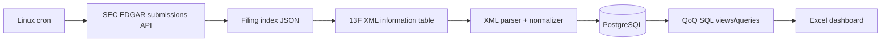

# Institutional Investor Holdings Tracker — SEC 13F

A production-style Python pipeline that discovers **13F-HR / 13F-HR/A** filings from SEC EDGAR, downloads the XML information table, normalizes holdings, loads them into PostgreSQL, calculates quarter-over-quarter position changes, and produces an Excel dashboard.

> Educational/research project. SEC filings are public disclosures, not investment advice. The pipeline preserves filing/accession identifiers so every row can be traced back to its source.

## Problem

Institutional holdings are public but difficult to analyze repeatedly: filings arrive as XML, identifiers can be inconsistent, amendments exist, and quarter-over-quarter changes require joining snapshots. This project turns those filings into queryable data and a review-friendly workbook.

## Data flow



## Features

- SEC submissions API discovery.
- Filing index lookup and information-table XML download.
- Namespace-tolerant XML parsing.
- PostgreSQL schema with filers, filings, holdings and security identifiers.
- Idempotent upserts keyed by accession + row number.
- Amendment-aware filing records.
- QoQ new / increased / decreased / sold-out / unchanged classification.
- Excel dashboard with holdings, QoQ changes and summary sheets.
- Cron example with logging and environment-file configuration.
- Unit tests using local XML fixtures; no SEC or PostgreSQL connection required for tests.

## Setup

```bash
python3 -m venv .venv
source .venv/bin/activate
pip install -e '.[test]'
```

### PostgreSQL

```bash
docker compose up -d db
cp .env.example .env
psql "$DATABASE_URL" -f sql/schema.sql
```

### Run a real filing

```bash
13f-ingest --cik 0001067983 --quarters 2 --output-dir data/raw
```

Set `SEC_USER_AGENT` to a descriptive value containing an email address before automated SEC access.

### Sample fixture

```bash
pytest -q
13f-ingest --xml examples/sample_13f.xml --cik 0000000001 --accession 0000000001-26-000001 --dashboard output/sample_dashboard.xlsx
```

## QoQ SQL

The canonical analytics query is in `sql/qoq_changes.sql`. It compares the latest two reporting periods for the same CIK and CUSIP and labels each position as `NEW`, `INCREASED`, `DECREASED`, `SOLD_OUT`, or `UNCHANGED`.

The query is amendment-aware: for a reporting period it uses the latest filing before calculating quarter-over-quarter changes.

## Sample output

| CIK | Issuer | CUSIP | Prior shares | Current shares | Change |
|---|---|---|---:|---:|---|
| 0000000001 | ACME CORP | 000000101 | 100,000 | 125,000 | INCREASED |
| 0000000001 | EXAMPLE ETF | 000000202 | 50,000 | 0 | SOLD_OUT |

The generated workbook contains `Summary`, `Holdings`, and `QoQ Changes` sheets.

## Cron

Install the example after changing paths and environment variables:

```cron
15 7 16 2,5,8,11 * /opt/13f-tracker/cron/run_13f.sh >> /var/log/13f-tracker.log 2>&1
```

## Project structure

```text
src/holdings_tracker/
  cli.py
  sec_client.py
  parser.py
  db.py
  dashboard.py
sql/
  schema.sql
  qoq_changes.sql
cron/run_13f.sh
examples/
tests/
```

## Engineering notes

- No browser scraping is used for the filing data path.
- XML parsing uses local-name matching so namespace prefixes do not break ingestion.
- Database writes are transactional.
- Tests do not require credentials or network access.
- The SEC public API does not require an API key; automated clients should follow SEC fair-access guidance.

## Sources

- SEC EDGAR APIs: https://www.sec.gov/search-filings/edgar-application-programming-interfaces
- SEC Form 13F technical specifications: https://www.sec.gov/submit-filings/technical-specifications
- SEC Form 13F data sets: https://www.sec.gov/data-research/sec-markets-data/form-13f-data-sets
