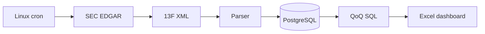

# Institutional Investor Holdings Tracker — SEC 13F

Production-style SEC 13F-HR ingestion pipeline with XML parsing, PostgreSQL persistence, amendment-aware QoQ analytics, Excel dashboard, tests, and Linux cron.

## Setup
```bash
python3 -m venv .venv
source .venv/bin/activate
pip install -e '.[test]'
docker compose up -d db
cp .env.example .env
psql "$DATABASE_URL" -f sql/schema.sql
pytest -q
```

Run a fixture:
```bash
13f-ingest --xml examples/sample_13f.xml --cik 0000000001 --dashboard output/sample_dashboard.xlsx
```

Run SEC ingestion with a descriptive `SEC_USER_AGENT` containing an email:
```bash
13f-ingest --cik 0001067983 --quarters 4 --output-dir data/raw --dashboard output/13f_dashboard.xlsx
```

The QoQ query in `sql/qoq_changes.sql` selects the latest filing for each reporting period, so amendments do not distort quarter-over-quarter comparisons. The workbook contains Summary, Holdings, and QoQ Changes sheets.

## Data flow


## Structure
`src/holdings_tracker/` contains SEC client, XML parser, database layer, dashboard builder and CLI. `sql/` contains schema and analytics. `tests/` contains local fixture tests. `examples/` contains sample filing data and dashboard output.

Educational/research project; not investment advice.